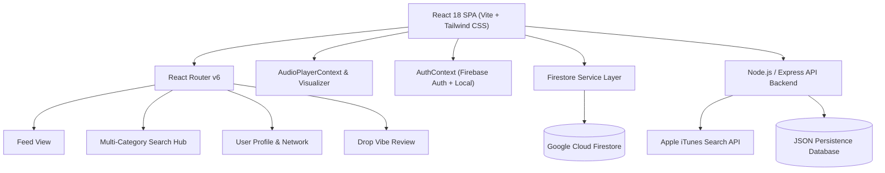

# 🎵 SoundVibe — Project Specification & Architecture

> **SoundVibe** is a modern social music discovery and taste-sharing platform that empowers music lovers, crate diggers, and sonic explorers to review tracks, compare music compatibility, preview songs in real time with audio visualizers, and connect through deep taste-driven community discussions.

---

## 📑 Table of Contents
1. [Project Overview & Mission](#-project-overview--mission)
2. [Key Architecture & Tech Stack](#-key-architecture--tech-stack)
3. [Core Feature Breakdown](#-core-feature-breakdown)
4. [Data Models & Schema](#-data-models--schema)
5. [API & Services Architecture](#-api--services-architecture)
6. [UI & Design System](#-ui--design-system)
7. [Security & Deployment](#-security--deployment)
8. [Roadmap & Upcoming Badges System](#-roadmap--upcoming-badges-system)

---

## 🌟 Project Overview & Mission

Most music platforms keep listening isolated or rely on algorithmic black boxes. SoundVibe turns music discovery into a human-first social experience:
- **Share Standout Thoughts**: Review singles and albums with ratings, standout lyrics, mood selectors, and custom vibe tags.
- **Listen Anywhere**: Stream 30-second audio previews globally without breaking page navigation.
- **Connect by Resonance**: Discover other curators based on sonic compatibility scores, shared genres, and desert island rotation picks.

---

## 🏗️ Key Architecture & Tech Stack



### 💻 Technology Stack:
- **Frontend Core**: React 18, Vite 6, React Router v6
- **Styling & UI**: Tailwind CSS, Lucide React Icons, Glassmorphic Design System, Canvas Confetti
- **Audio & Visuals**: Web Audio API, HTML5 Audio, Canvas Waveform Visualizer
- **Cloud Database**: Google Cloud Firestore (`users`, `posts` collections)
- **Backend**: Node.js, Express.js (REST API, music catalog proxy)
- **Deployment**: Render Web Service, Git Version Control

---

## ⚡ Core Feature Breakdown

### 1. 🔥 Social Vibe Feed (`FeedPage.jsx`, `PostCard.jsx`)
- **Rich Music Reviews**: Review tracks with 1–5 star ratings, mood tags, favorite lyric highlights, and `#vibeTags`.
- **6 Interactive Emoji Reactions**: `🔥 Fire`, `🌊 Vibe`, `❤️ Love`, `🔁 On Repeat`, `🧠 Mindblown`, `😴 Overrated`.
- **Atomic Comment Threads**: Real-time comments with inline editing, deletion confirmation, and timestamp tracking.
- **Feed Filters**: Quick toggle between *All Vibes*, *Following Only*, *Trending*, and *Top Rated*.

### 2. 🎧 Global Persistent Audio Player & Sound Visualizer (`AudioPlayerContext.jsx`, `PlayerBar.jsx`)
- **Docked Audio Bar**: Stays active and persistent across all route changes.
- **Playback Controls**: Seekbar scrubbing, volume controls, play/pause, next/previous, and repeat modes.
- **Waveform Visualizer Modal**: Real-time canvas audio visualization with glowing spinning vinyl graphics.

### 3. 🔍 Unified Discovery Search Hub (`SearchPage.jsx`, `/search`)
- **Multi-Category Filtering**:
  - `All Results`: Comprehensive overview of all matches.
  - `Songs & Tracks`: Direct music catalog search with 30s previews and 1-click `+ Drop Vibe` button.
  - `Curators & Users`: Live search across usernames (`@handle`), display names, and bios with 1-click Follow toggle.
  - `Vibe Reviews`: Search posts by headline, review text, favorite lyrics, or track name.
  - `Vibe Tags`: Search and aggregate community hashtag labels with post counts.
- **Navbar Autocomplete**: Instant live suggestion dropdown with top matching curators and songs.

### 4. 👥 Curator Profiles & Network (`ProfilePage.jsx`, `FollowListModal.jsx`)
- **Profile Showcase**: Desert Island Heavy Rotation tracks, bio, favorite genres, and post history.
- **Network Modal**: Clickable Followers & Following counts that open an interactive list with direct profile links and follow/unfollow buttons.
- **Taste Matcher**: Real-time compatibility analyzer comparing musical affinities between any two curators.

---

## 🗄️ Data Models & Schema

### `users` Collection (Cloud Firestore / Backend)
```typescript
interface User {
  id: string;              // UID or user identifier
  username: string;        // Unique handle (e.g., "jatin")
  name: string;            // Display Name
  email?: string;          // User Email
  avatar: string;          // DiceBear SVG or custom photo URL
  bio: string;             // User biography & musical taste description
  favoriteGenres: string[];// ['Psychedelic Rock', 'Synthwave', 'Neo-Soul']
  topTracks: Track[];      // Top 4 Desert Island tracks
  followers: string[];     // Array of follower User IDs / handles
  following: string[];     // Array of following User IDs / handles
  createdAt: string;       // ISO Timestamp
}
```

### `posts` Collection (Cloud Firestore / Backend)
```typescript
interface Post {
  id: string;              // Unique Post ID
  userId: string;          // Creator User ID
  author: {
    id: string;
    username: string;
    name: string;
    avatar: string;
  };
  track: {
    id: string;
    title: string;
    artist: string;
    album: string;
    artwork: string;
    previewUrl: string;
    genre: string;
    durationMs?: number;
  };
  rating: number;          // 1 to 5
  mood: string;            // e.g. "Euphoric", "Melancholic", "Late Night Drive"
  headline: string;        // Quick takeaway thought
  review: string;          // In-depth review text
  favoriteLyric?: string;  // Standout lyric quote
  vibeTags: string[];      // ['#synthwave', '#nightdrive']
  likes: string[];         // Array of user IDs who liked
  reactions: {
    fire: string[];
    vibe: string[];
    heart: string[];
    repeat: string[];
    mindblown: string[];
    overrated: string[];
  };
  comments: Comment[];     // Array of comment objects
  createdAt: string;       // ISO Timestamp
}
```

### `Comment` Schema
```typescript
interface Comment {
  id: string;              // Unique Comment ID
  userId: string;
  username: string;
  userName: string;
  userAvatar: string;
  text: string;            // Comment text
  createdAt: string;       // ISO Timestamp
  updatedAt?: string;      // ISO Timestamp if edited
}
```

---

## 🌐 API & Services Architecture

### REST Endpoints (`server/src/routes.js`):
- `GET /api/search?q={query}&type={all|songs|users|posts|tags}&limit={n}`: Multi-category discovery search.
- `GET /api/music/search?q={query}`: Proxy search to Apple iTunes API.
- `GET /api/music/trending`: Curated trending tracks.
- `GET /api/posts`: Fetch in-memory posts with filter support.
- `POST /api/posts`: Create a new vibe review.
- `POST /api/posts/:id/comments`: Add a comment.
- `PUT /api/posts/:postId/comments/:commentId`: Edit a comment.
- `DELETE /api/posts/:postId/comments/:commentId`: Delete a comment.
- `GET /api/users/:id/followers`: Retrieve follower list.
- `GET /api/users/:id/following`: Retrieve following list.

### Cloud Firestore Service (`client/src/services/firestoreService.js`):
- `getFirestorePosts({ filter, genre, userId, currentUserId })`
- `createFirestorePost(postData)`
- `deleteFirestorePost(postId)`
- `togglePostLikeFirestore(postId, userId)`
- `togglePostReactionFirestore(postId, reactionType, userId)`
- `addCommentToFirestorePost(postId, commentData)`
- `updateCommentInFirestorePost(postId, commentId, newText, userId)`
- `deleteCommentFromFirestorePost(postId, commentId, userId)`
- `getFirestoreUser(uidOrUsername)`
- `updateFirestoreUser(uid, updates)`
- `toggleFollowFirestore(currentUid, targetUid)`
- `getFirestoreFollowLists(uidOrUsername)`
- `searchFirestoreUnified({ query, type, limit })`

---

## 🎨 UI & Design System

- **Color Palette**:
  - `brand-blue`: `#38bdf8` (Sky Blue Highlights & Focus Glows)
  - `brand-violet`: `#818cf8` (Indigo Accents)
  - `brand-pink`: `#f472b6` (Vibrant Pulse Accents)
  - `dark-950`: `#030712` (Deep Obsidian Background)
  - `dark-900`: `#0f172a` (Card Surface Glass)
- **Glassmorphism**: High backdrop blur (`backdrop-blur-xl`), subtle translucent white borders (`border-white/10`), rounded corners (`rounded-2xl`, `rounded-3xl`).
- **Responsive Layout**: Fluid desktop grid with persistent sticky top navbar and Twitter/Instagram-inspired 5-tab mobile bottom bar (`Feed`, `Explore`, `Drop`, `Following`, `Profile`).

---

## 🔒 Security & Deployment

- **Firebase Config**: Secure client initialization with Cloud Firestore database rules.
- **Local Express Fallback**: Built-in mock data engine ensuring full functionality even offline.
- **Production URL**: [https://soundvibe-2pdf.onrender.com/](https://soundvibe-2pdf.onrender.com/)
- **Repository**: [https://github.com/Jatin-nicon/soundvibe](https://github.com/Jatin-nicon/soundvibe)

---

## 🏅 Roadmap & Upcoming Badges System

In the next iteration, we will introduce a **Curator Badges & Achievements System**:
1. 🏆 **Badges & Titles**:
   - 🎧 **Crate Digger**: For reviewing 10+ obscure/underground gems.
   - ⚡ **Sonic Trendsetter**: When a review gets 25+ reactions.
   - 💬 **Discussion Catalyst**: For contributing 50+ insightful comments.
   - 🌟 **Verified Curator**: Dedicated badge for verified tastemakers and artists.
   - 🔥 **Heavy Rotator**: For users with fully customized Top 4 Desert Island discs.
2. 📊 **Curator Leaderboards**: Top reviewers of the week and most compatible listeners.
3. 🎵 **Spotify / Apple Music OAuth Export**: Export SoundVibe review queues directly into personal Spotify playlists.
